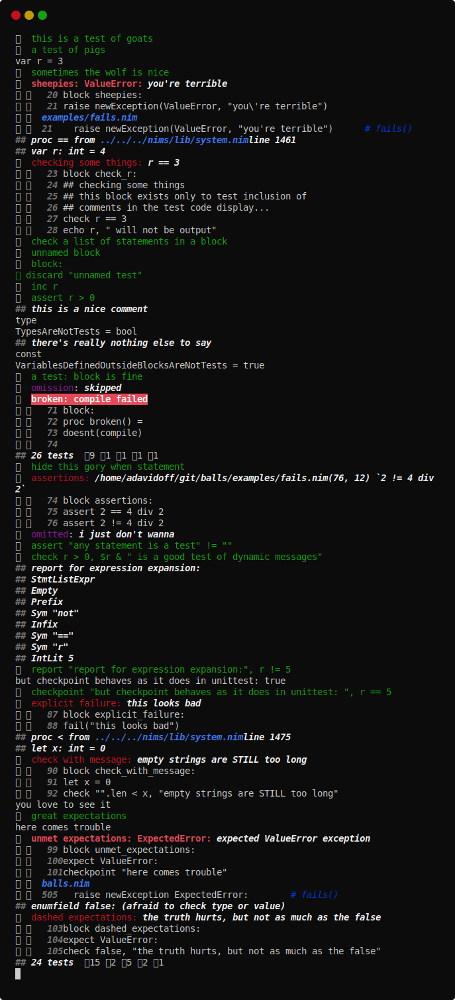

# testes [](https://travis-ci.org/disruptek/testes)

A small unittest macro with some features I needed.

## Why

Because `testament` and `testutils` are going nowhere fast.

## Goals

- better stack traces and test source output
- less magical syntax and less output omission
- aim to run many cheap tests in fewer files
- easily accumulate state between tests when desired
- when attached to a tty, errors are not fatal
- individual tests don't even have to compile
- replaces and enhances unittest at the same time
- easier test reordering, built-in timing, mem stats
- smaller, more self-evident testing macro

## Notable Mentions

- With `--define:release`, your tests must compile.
- `check` doesn't work inside other scopes due to a bug.

## Usage

```nim
import testes

expandMacros:
  testes:

    block goats:
      ## this is a test of goats

    block pigs:
      ## a test of pigs

    var r = 3

    block sometimes_the_wolf_is_nice:
      break
      inc r

    block sheepies:
      raise newException(ValueError, "you're terrible")

    block check_r:
      ## checking some things
      ## this block exists only to test inclusion of
      ## comments in the test code display...
      check r == 3
      dump r
      check r == 2

    block:
      ## unnamed block
      discard

    block:
      discard "unnamed test"

    test "a test: block":
      discard

    block omission:
      skip()

    when defined(release):
      testes:
        const compile = true
        proc doesnt(c: bool) =
          if not c:
            raise

        block:
          proc fixed() = doesnt(compile)
    else:
      testes:
        block:
          proc broken() = doesnt(compile)

    block assertions:
      assert 2 == 4 div 2
      assert 2 != 4 div 2
```



## Documentation
See [the documentation for the testes module](https://disruptek.github.io/testes/testes.html) as generated directly from the source.

## License
MIT
